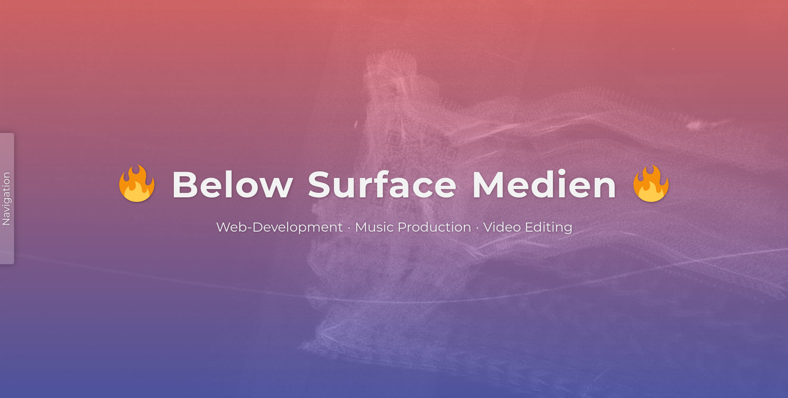
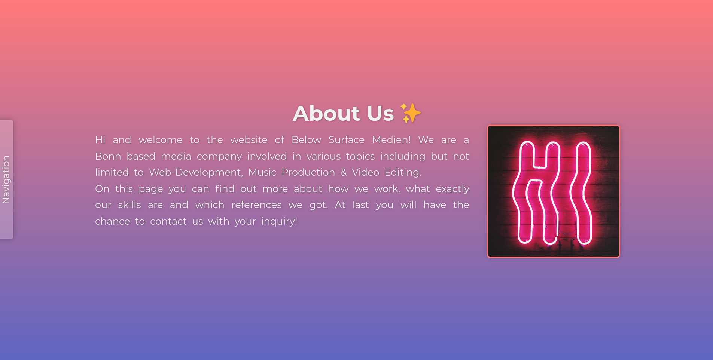
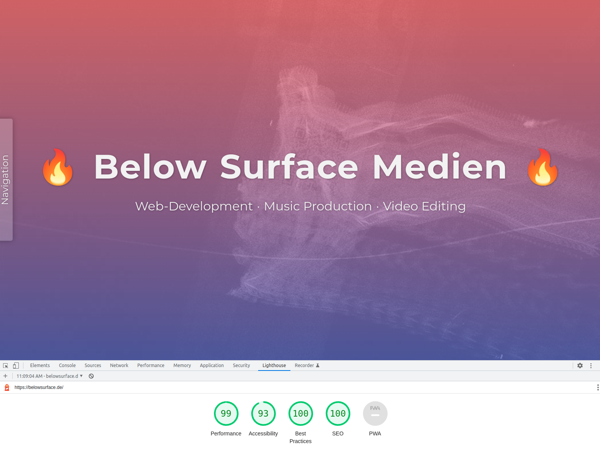

# Portfolio website: belowsurface.de
My portfolio page belowsurface.de. Here i gather a small overview of my skills and references. Also a contact form is available.
Live version: https://belowsurface.de
# Used languages
- React
- JavaScript
- HTML
- SCSS

## Used libraries
- React-Lazyload, to lazyload images once they appear in vision of the use
- React-Router-Dom, for page navigation
- React-Router-Hash-Link, for navigating to sections of a page (smoothly)
- Sass, to import SCSS files without compiling them
- Emailjs, for the contact form

## Note
The Impressum and Datenschutz pages are not uploaded to Github, but available on the live page.

## Screenshots

